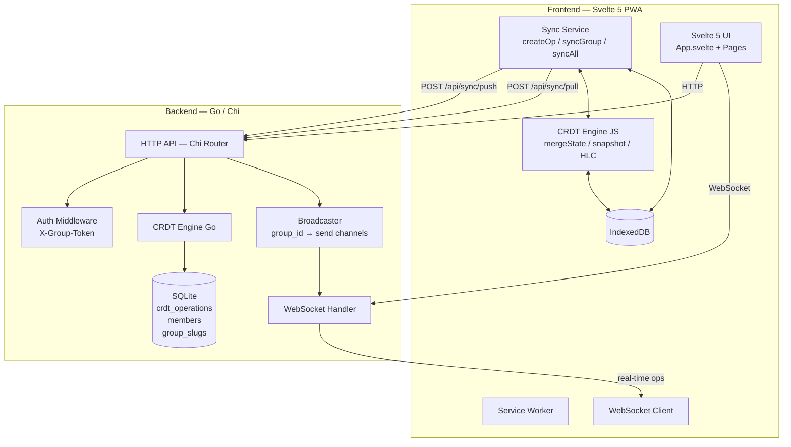
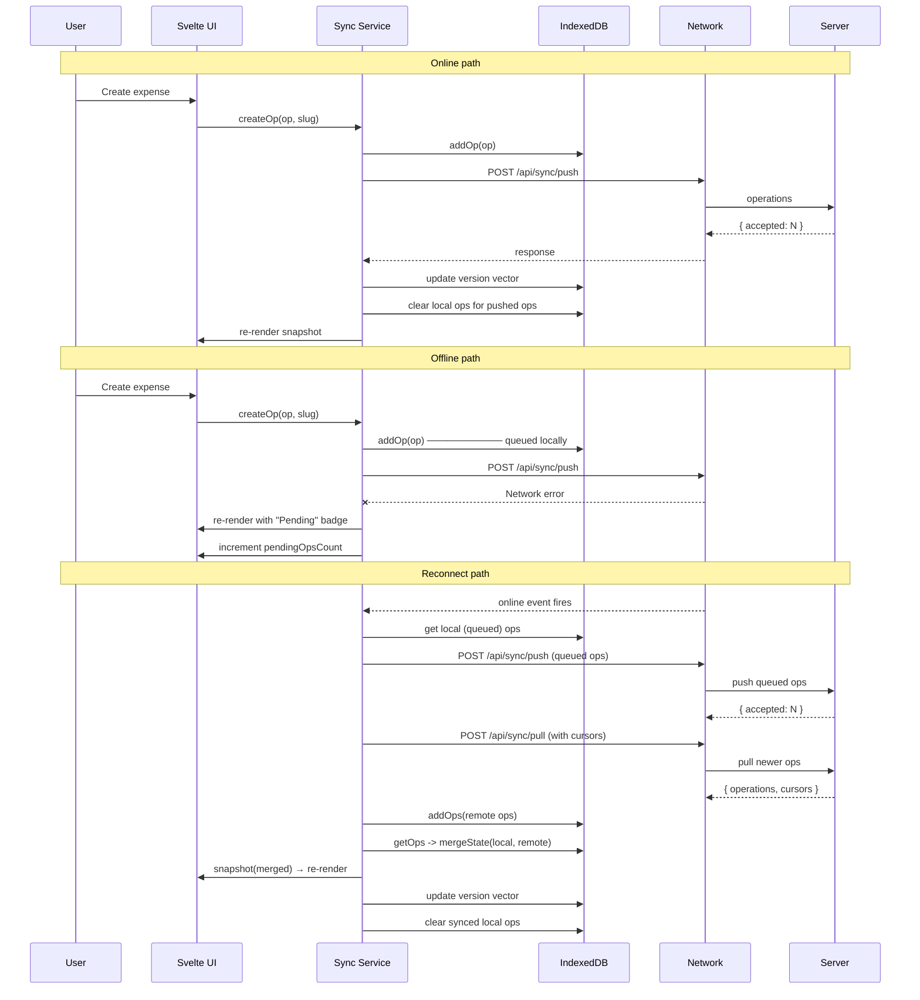

# I Owe You — Architecture Guide

**Project:** I Owe You — group expense tracking with offline-first CRDT sync.
**Stack:** Go backend + Svelte 5 PWA frontend, SQLite persistence, CRDT-based data model.
**Repository:** `github.com/matthewghuang/ioweyou`

---

## Overview

I Owe You is a mobile-first progressive web application for tracking shared expenses within groups. The system is built around an append-only CRDT (Conflict-free Replicated Data Type) operation log that enables offline writes, conflict-free merge, and real-time collaboration without a central conflict resolution service.

The backend is a single Go binary serving both a JSON API and a static Svelte 5 PWA. There are no external services beyond SQLite — the entire system runs on one process.

---

## System Architecture

### High-Level Diagram



### Component Descriptions

#### Backend

| Component | File(s) | Responsibility |
|---|---|---|
| **Chi Router** | `internal/api/router.go` | Mounts all routes, applies middleware (logging, recovery, CORS, auth), serves SPA fallback. |
| **Auth Middleware** | `internal/auth/auth.go` | Extracts `X-Group-Token` header, looks up `MemberInfo` from `members` table, injects into request context. Three public routes bypass auth. |
| **Group Handlers** | `internal/api/groups.go` | Create, join, info, get, update, leave. Group creation writes CRDT ops for the group document and inserts relational rows for slug and membership. |
| **Expense Handlers** | `internal/api/expenses.go` | CRUD for expense documents. Creates LWW ops for scalars (description, amount, paid_by, group_id, split_type) and RGA ops for splits. Uses `StateStore.Append` and `StateStore.GetLatestState`. |
| **Payment Handlers** | `internal/api/payments.go` | CRUD for payment documents. Similar pattern to expenses but with status lifecycle (pending → confirmed via `POST .../confirm`). |
| **Balance Handler** | `internal/api/balances.go` | Queries all doc_ids belonging to a group, projects each document via CRDT snapshot, computes net balances per user, applies greedy settlement algorithm, returns recommended transfers with per-expense breakdown. |
| **CRDT Engine (Go)** | `internal/crdt/merge.go`, `operation.go`, `clock.go`, `store.go` | Operation type definition, `MergeState` (dedup + LWW conflict resolution + RGA ordering), `Snapshot` (project ops → JSON), `HLC` (hybrid logical clock). Defines `StateStore` interface. |
| **SQLite Store** | `internal/store/sqlite.go`, `schema.go` | Implements `StateStore` over SQLite. `Append` uses `INSERT OR IGNORE` for idempotent dedup. `GetOps` supports cursor‑based filtering. |
| **Sync: Push/Pull** | `internal/sync/handler.go` | `HandlePush`: receives ops batch, deduplicates via UNIQUE constraint, observes HLC timestamps, broadcasts accepted ops. `HandlePull`: reads ops newer than per-author cursors, returns filtered set plus updated cursors. |
| **WebSocket Handler** | `internal/sync/websocket.go` | Upgrades HTTP to WebSocket with token auth via query param. Client sends `subscribe` messages with `group_id`. Runs read/write pump goroutines with periodic ping/pong. |
| **Broadcaster** | `internal/sync/broadcaster.go` | Manages `map[groupID]map[sendChan]bool`. `Broadcast` JSON-marshals operations and sends to all subscribers of a group (non-blocking; drops slow consumers). |

#### Frontend

| Component | File(s) | Responsibility |
|---|---|---|
| **App.svelte** | `frontend/src/App.svelte` | Root component. Reads `currentPage` store, renders the appropriate page component. Shows loading spinner until group data is ready. Renders global `<OfflineBanner />` and `<ToastContainer />`. |
| **Landing** | `frontend/src/pages/Landing.svelte` | Create-group form. Calls `POST /api/groups`, stores token in localStorage, shows share link. |
| **Join** | `frontend/src/pages/Join.svelte` | Join-group form. Parses slug from URL path, optionally fetches group info for preview. Calls `POST /api/groups/join`. |
| **Groups** | `frontend/src/pages/Groups.svelte` | Lists groups from localStorage metadata, fetches per-group balance summaries. Taps into group to navigate to detail view. |
| **GroupDetail** | `frontend/src/pages/GroupDetail.svelte` | Main interaction surface. Three tabs (expenses / payments / balances) with full CRUD. Manages HLC, creates ops via sync service, subscribes to WebSocket for real-time updates. Code-split (lazy-loaded). |
| **CRDT Engine (JS)** | `frontend/src/lib/crdt.js` | Pure JS port of the Go CRDT package. `mergeState`, `snapshot`, `HLC`, `orderRGAList`, `buildDeleteSet`. ~500 lines, runs identically to server logic. |
| **Sync Service** | `frontend/src/lib/sync.js` | `createOp`: stores op locally in IndexedDB, attempts immediate push when online. `syncGroup`: push queued ops → pull newer ops → merge → re-render. `syncAll`: iterate all groups. Maintains `syncInProgress` store. |
| **IndexedDB Layer** | `frontend/src/lib/db.js` | `addOp`/`addOps`: CRUD for operations with compound key dedup. `getOps` with optional groupSlug prefix filter. `getVersionVector`/`setVersionVector`: per-group cursors. `getGroupMeta`/`setGroupMeta`: cached group metadata. |
| **API Client** | `frontend/src/lib/api.js` | Thin `fetch` wrapper. Stores tokens in localStorage as `ioweyou_token_<slug>`. Sends `X-Group-Token` header. |
| **WebSocket Client** | `frontend/src/lib/websocket.js` | Connects, subscribes to group_id, calls `onUpdateCallback` on incoming messages. Auto-reconnect with backoff. |
| **Gestures** | `frontend/src/lib/gestures.js` | Svelte actions: `swipeBack` (right-swipe from left edge), `pullToRefresh` (pull-down), `swipeReveal` (swipe-left to reveal action button). |
| **Network Store** | `frontend/src/lib/networkStore.js` | `online`/`offline` Svelte stores wired to browser `online`/`offline` events. `pendingOpsCount` store. |
| **UI Components** | `frontend/src/lib/*.svelte` | `Toast`/`ToastContainer` (toast queue), `BottomSheet` (confirmation dialog), `OfflineBanner` (offline indicator), `ShareModal` (invite link with QR code). |

---

## Data Model

### CRDT Operations

All mutable state is stored as an append-only log of `Operation` records. Every operation represents one atomic mutation on a document.

```go
type Operation struct {
    DocID      string          // document identifier (UUID)
    OpType     string          // "lww" | "rga_insert" | "rga_delete"
    Field      string          // field name within the document
    Value      json.RawMessage // JSON-encoded value
    ItemID     string          // for RGA: item identifier (UUID)
    PrevItemID string          // for RGA: previous item in list order
    AuthorID   string          // who created this op (member_id)
    Timestamp  Timestamp       // HLC timestamp (wall_time + logical)
}
```

There are three operation types:

| OpType | Purpose | Conflict Resolution |
|---|---|---|
| `lww` | Scalar field writes | Highest `(wall_time, logical, author_id)` wins |
| `rga_insert` | Insert item into ordered list | Ordered by `prev_item_id` chain with timestamp-based insertion |
| `rga_delete` | Remove item from ordered list | Delete applies when timestamp > corresponding insert's timestamp |

### Deduplication Key

Operations are uniquely identified by the compound key `(doc_id, author_id, wall_time, logical)`. The server uses `INSERT OR IGNORE` for idempotent deduplication. Both client and server compute this key identically.

### LWW (Last-Writer-Wins) Registers

LWW registers are used for all scalar fields:

- **Group**: `name`, `created_at`
- **Expense**: `description`, `amount`, `paid_by`, `group_id`, `split_type`, `created_at`, `tombstone`
- **Payment**: `from_user`, `to_user`, `amount`, `method`, `status`, `group_id`, `created_at`, `confirmed_at`, `confirmed_by`, `tombstone`

Conflict resolution: among all LWW operations for the same `(doc_id, field)`, the op with the highest `(wall_time, logical, author_id)` wins during merge. The `MergeState` function (both Go and JS implementations) performs this selection identically.

### RGA (Replicated Growable Array)

RGA is used for the `splits` field on expense documents — an ordered list of per-user split amounts.

- **Insert**: `rga_insert` with an `item_id` (UUID) and `prev_item_id` referencing the intended predecessor.
- **Delete**: `rga_delete` with an `item_id`. A delete only removes an item if the delete's timestamp is strictly greater than the corresponding insert's timestamp.
- **Speculative delete semantics**: When merging local and remote operations, a delete from the local node only applies to inserts that the local node knew about (present in the local slice). This prevents one client from deleting an item it has never seen. Remote deletes apply to all inserts. This logic is in `buildDeleteSet` in both Go and JS.
- **Ordering**: Surviving inserts are ordered by following the `prev_item_id` chain. When `prev_item_id` is not found (deleted or never seen), the item is appended at the end. Inserts arrive sorted by `(wall_time, logical, author_id, item_id)`, and insertion respects this sort when placing items after the anchor.

### Document Structure

Operations are projected into documents via `Snapshot`. A snapshot queries all ops for a `doc_id`, merges them, and produces a flat JSON object.

**Group document:**

```
doc_id: "group-uuid"
  lww:name        = "Ski Trip 2025"
  lww:created_at  = 1719876543210
```

**Expense document:**

```
doc_id: "expense-uuid"
  lww:group_id    = "group-uuid"
  lww:description = "Dinner"
  lww:amount      = 100.00
  lww:paid_by     = "member-uuid"
  lww:split_type  = "equal"
  lww:created_at  = 1719876543210
  lww:tombstone   = true           (only present if deleted)
  rga:splits      = [
    { user_id: "a", amount: 25.00 },
    { user_id: "b", amount: 25.00 },
    { user_id: "c", amount: 25.00 },
    { user_id: "d", amount: 25.00 }
  ]
```

**Payment document:**

```
doc_id: "payment-uuid"
  lww:group_id     = "group-uuid"
  lww:from_user    = "member-uuid"
  lww:to_user      = "member-uuid"
  lww:amount       = 50.00
  lww:method       = "venmo"
  lww:status       = "confirmed"
  lww:created_at   = 1719876543210
  lww:confirmed_at = 1719876633210
  lww:confirmed_by = "member-uuid"
  lww:tombstone    = true          (only present if cancelled)
```

---

## HLC (Hybrid Logical Clock)

Both server and client maintain an HLC for generating operation timestamps that are causally consistent across nodes.

**Algorithm** (in `internal/crdt/clock.go` and `frontend/src/lib/crdt.js`):

```
Now():
  wt = max(current wall time, stored wall time)
  if wt > stored wall time:
    stored wall time = wt
    stored logical = 0
  stored logical++
  return { wall_time: stored wall time, logical }

Observe(ts):
  if ts.wall_time > stored wall time:
    stored wall time = ts.wall_time
    stored logical = max(ts.logical, stored logical) + 1
  else if ts.wall_time == stored wall time:
    stored logical = max(ts.logical, stored logical) + 1
  else:
    stored logical++
```

- **`Now()`**: Called on every local write. Advances the clock and returns a strictly increasing timestamp.
- **`Observe(ts)`**: Called on receiving a remote timestamp (during push, the server calls `hlc.Observe(op.Timestamp)` for each incoming op). This ensures the local clock stays ahead of all observed timestamps, preserving causal ordering.

Each operation carries a `Timestamp{wall_time, logical}`. Timestamps are compared lexicographically: `(wall_time, logical, author_id)`.

---

## Sync Protocol

### Push — `POST /api/sync/push`

**Purpose**: Client sends locally-created operations to the server.

**Flow**:

1. Client collects operations from its local queue.
2. Client sends `{"operations": [...]}`.
3. Server authenticates the member, verifies group membership for all affected groups.
4. Server calls `hlc.Observe(op.Timestamp)` for each incoming op (maintaining causal ordering).
5. Server inserts each op via `INSERT OR IGNORE INTO crdt_operations ...`. Duplicates (same `doc_id, author_id, wall_time, logical`) are silently ignored.
6. Server counts accepted (non-duplicate) ops.
7. Server broadcasts accepted ops to WebSocket subscribers of relevant groups.
8. Server responds with `{"accepted": N}`.

**Authentication**: Server resolves which groups the operations belong to (by inspecting `group_id` field ops and checking existing docs in the DB), then verifies the member belongs to each group.

### Pull — `POST /api/sync/pull`

**Purpose**: Client fetches operations it hasn't seen yet, using per-author version vectors as cursors.

**Flow**:

1. Client sends `{"doc_id": "...", "cursors": {"author_id": {"wall_time": ..., "logical": ...}, ...}}`.
2. Server queries all operations for the requested `doc_id`, ordered by `(wall_time, logical, author_id)`.
3. Server filters to operations whose `(wall_time, logical)` is strictly greater than the cursor for their author.
4. Server builds updated cursors from the returned operations (max per author).
5. Server responds with `{"operations": [...], "cursors": {...}}`.

**Version vector semantics**: Each cursor is a per-author high-water mark. The server returns all ops that are newer than the cursor for their respective author. If no cursor exists for an author, all of that author's ops are returned.

### WebSocket — `/api/ws`

**Purpose**: Real-time fan-out of operations to connected clients.

**Connection**:

- Upgrade from HTTP via `GET /api/ws?token=<cookie_token>`.
- Authentication via query parameter (not header, since WebSocket upgrade can't set custom headers easily).
- On upgrade failure, returns 401.

**Protocol**:

- Client sends `{"type": "subscribe", "group_id": "..."}` after connecting.
- Client may switch groups by sending a new subscribe message.
- Server registers the client's send channel with the Broadcaster for the given `group_id`.
- Server sends `{"type": "change", "operations": [...]}` to all subscribers of a group when new ops are accepted via push.
- Periodic ping/pong keeps connections alive.
- On close, the client is unsubscribed from all groups.

### Offline-First Architecture



**Key invariant**: Writes always go to IndexedDB first, even when online. The push to the server is a background attempt. If it fails, the op stays in the local queue with a `"Pending"` badge on the corresponding item. CRDT merge semantics ensure that ops applied in any order converge to the same state across all clients.

---

## Frontend Architecture

### Svelte 5 Patterns

The frontend uses Svelte 5 runes consistently:

- **`$state()`** — reactive local component state (form fields, loaded data, UI flags).
- **`$derived()`** — computed values (invite link from slug, custom split sum, formatted dates).
- **`$effect()`** — side effects (WebSocket connect/disconnect lifecycle, loading data on mount).
- **`$props()`** — component props (`onBack`, `onSelectGroup`).
- **Svelte actions (`use:`)** — DOM-level behaviors (`swipeBack`, `pullToRefresh`, `swipeReveal`, `haptic`, `scrollIntoViewOnFocus`).

### Module Organization

```
frontend/src/
├── App.svelte                    # Root: routing via currentPage store
├── lib/
│   ├── api.js                    # REST client + localStorage token management
│   ├── stores.js                 # currentPage, currentGroupSlug Svelte stores
│   ├── websocket.js              # WebSocket connection management with reconnect
│   ├── gestures.js               # swipeBack, pullToRefresh, swipeReveal Svelte actions
│   ├── crdt.js                   # mergeState, snapshot, HLC, orderRGAList, buildDeleteSet
│   ├── db.js                     # IndexedDB: ops, version vectors, group metadata
│   ├── sync.js                   # createOp, syncGroup, syncAll, getSnapshot, getLocalOps
│   ├── networkStore.js           # online/offline/pendingOpsCount stores
│   ├── toastStore.js             # Toast notification queue (showToast, dismissToast)
│   ├── haptic.js                 # Haptic feedback Svelte action (vibrate API)
│   ├── forms.js                  # scrollIntoViewOnFocus Svelte action
│   ├── Toast.svelte              # Single toast notification
│   ├── ToastContainer.svelte     # Toast stack renderer
│   ├── BottomSheet.svelte        # Confirmation dialog sheet
│   ├── OfflineBanner.svelte      # Offline indicator banner
│   └── ShareModal.svelte         # Invite link display with QR code
├── pages/
│   ├── Landing.svelte            # Create group
│   ├── Join.svelte               # Join group via invite link
│   ├── Groups.svelte             # Group list with balance summaries
│   └── GroupDetail.svelte        # Expense/payment/balance tabs + full CRUD
└── (other vite/PWA config files)
```

### Page Components

| Page | Route (via currentPage store) | Key Behavior |
|---|---|---|
| **Landing** | `'landing'` | Create group form. Stores token + group info in localStorage on success. |
| **Join** | `'join'` | Parses slug from `/group/:slug` URL path. Fetches group info for preview. Join form stores token on success. |
| **Groups** | `'groups'` | Reads all groups from localStorage metadata. Fetches per-group balance. Taps row to navigate to GroupDetail. |
| **GroupDetail** | `'group'` | Three tabs (expenses, payments, balances). Manages HLC, calls sync service for CRUD. Subscribes to WebSocket for real-time updates. Swipe gestures on each item. FAB to add new items. |

### Lazy Loading

GroupDetail is code-split via dynamic import. The main bundle is ~90 kB; the GroupDetail chunk (~34 kB) is loaded lazily only when the user navigates to a group. This is configured through Vite's dynamic import mechanism.

### PWA

The frontend is an installable PWA via `vite-plugin-pwa`. It generates a service worker for caching, includes a web app manifest, and supports offline-capable operation through the IndexedDB + CRDT architecture described above.

---

## Security Model

- **No user accounts.** There are no passwords, email verification, or session cookies. Each group is accessed via a `cookie_token` — a random 64-character hex string (32 bytes from `crypto/rand`).
- **Token storage.** Tokens are stored in `localStorage` under the key `ioweyou_token_<slug>`. They are sent as the `X-Group-Token` HTTP header on every authenticated request.
- **Group membership.** The `members` table stores a `secret_hash` (SHA-256 of the group's secret passphrase) alongside the `cookie_token`. On join, if the username already exists in the group, the secret must match the stored hash; otherwise a new member is created.
- **Auth middleware.** `auth.AuthMiddleware` extracts `X-Group-Token`, looks up the member in `LookupMemberByToken`, and injects `auth.MemberInfo` into the request context. Missing or invalid tokens return 401.
- **Group access control.** All mutation endpoints verify membership via `isGroupMember(db, groupID, memberID)`. The member can only act within groups they belong to.
- **Public endpoints.** Three routes are public (no token required): `POST /api/groups`, `POST /api/groups/join`, `GET /api/groups/{slug}/info`. The info endpoint returns only the group name and member count — no sensitive data.
- **Payment confirmation.** Only the recipient (`to_user`) can confirm a payment. This is enforced in `ConfirmPayment`.

---

## Key Design Decisions

### 1. CRDT over Traditional REST

Traditional REST APIs with row-level locking, optimistic concurrency, or last-write-wins at the resource level don't compose well with offline writes. By modeling all state as an append-only log of CRDT operations, every node (client or server) can accept writes independently. Merge is deterministic and converges to the same state regardless of operation order. This eliminates the need for conflict resolution UI, rebase logic, or "last save wins" data loss.

### 2. Per-Group Tokens over User Accounts

No email, password, or multi-user account system. Each group has a shareable invite link containing the slug and a secret passphrase. This reduces implementation complexity (no auth flows, no password hashing, no session management) and is privacy-preserving — users identify themselves only by a chosen name within each group. The trade-off is that there is no cross-group user identity and no password recovery.

### 3. SQLite over Postgres

A single-binary deployment with zero configuration. SQLite with WAL mode provides sufficient concurrency for a group expense tracker (single-server, moderate write volume). Running SQLite in Docker on a persistent volume handles data durability. The `modernc.org/sqlite` pure-Go driver avoids CGO dependencies, enabling fully static binaries.

### 4. IndexedDB over localStorage

IndexedDB provides larger storage (unlimited vs 5 MB), structured data (object stores with indexes), and an async API (no synchronous blocking on the main thread). The operation log can grow large over time, and IndexedDB handles this comfortably. The trade-off is a more complex API, wrapped cleanly in `db.js`.

### 5. Svelte 5 over React

Svelte 5 compiles away the framework at build time, producing smaller bundles (~90 kB main) with less boilerplate than React. The `$state`/`$derived`/`$effect` runes provide native reactivity without hooks, effects arrays, or memorization. For a mobile-first PWA, bundle size and performance are critical.

### 6. Pure JS CRDT over WASM

The CRDT merge logic is about 500 lines of pure JavaScript, ported directly from the Go implementation. A WASM compilation would add build complexity, increase bundle size, and make debugging harder. The JS implementation runs identically to the Go version — both use the same algorithm with verified byte-identical dedup keys and timestamp comparison.

### 7. Operation-Level Sync over HTTP Caching

Traditional HTTP caching (ETags, Last-Modified) would require reconciling stale caches against server state. By syncing at the operation level and treating merge as the source of truth, the client can always compute the correct state from its local ops plus any new ops pulled from the server. There is no stale cache problem — only operations you haven't seen yet.

---

## API Route Map

```
POST   /api/groups                           CreateGroup         (public)
POST   /api/groups/join                      JoinGroup           (public)
GET    /api/groups/{slug}/info               GroupInfo           (public)

GET    /api/ws                               HandleWS            (WebSocket upgrade, token via query)

(All routes below require X-Group-Token header)

GET    /api/groups/{slug}                    GetGroup
PATCH  /api/groups/{slug}                    UpdateGroup
DELETE /api/groups/{slug}/members/me         LeaveGroup

POST   /api/groups/{slug}/expenses           CreateExpense
GET    /api/groups/{slug}/expenses           ListExpenses
GET    /api/expenses/{id}                    GetExpense
PATCH  /api/expenses/{id}                    UpdateExpense
DELETE /api/expenses/{id}                    DeleteExpense

POST   /api/groups/{slug}/payments           CreatePayment
GET    /api/groups/{slug}/payments           ListPayments
GET    /api/payments/{id}                    GetPayment
POST   /api/payments/{id}/confirm            ConfirmPayment
DELETE /api/payments/{id}                    CancelPayment
PATCH  /api/payments/{id}                    UpdatePayment

GET    /api/groups/{slug}/balances           GetBalances

POST   /api/sync/push                        HandlePush
POST   /api/sync/pull                        HandlePull
```

**Route conventions:**
- Resources nested under groups use `{slug}` (human-readable slug, not UUID).
- Individual resources use `{id}` (UUID).
- Sync endpoints are at the top level but require auth.
- All mutations verify group membership before acting.
- `ListExpenses`/`ListPayments` discover documents via `SELECT DISTINCT doc_id FROM crdt_operations WHERE field = 'group_id' AND value = ?`.

---

## Database Schema

### `crdt_operations` — Append-only CRDT operation log

```sql
CREATE TABLE crdt_operations (
    id          INTEGER PRIMARY KEY AUTOINCREMENT,
    doc_id      TEXT NOT NULL,       -- document UUID
    op_type     TEXT NOT NULL,       -- 'lww', 'rga_insert', or 'rga_delete'
    field       TEXT,                -- field name within the document
    value       TEXT NOT NULL,       -- JSON-encoded value
    item_id     TEXT,                -- RGA item UUID (null for LWW)
    prev_item_id TEXT,               -- RGA predecessor UUID (null for LWW)
    author_id   TEXT NOT NULL,       -- member UUID who created the op
    wall_time   INTEGER NOT NULL,    -- HLC wall time (nanoseconds)
    logical     INTEGER NOT NULL,    -- HLC logical counter

    UNIQUE(doc_id, author_id, wall_time, logical)
);

CREATE INDEX idx_ops_doc ON crdt_operations(doc_id);
CREATE INDEX idx_ops_author ON crdt_operations(author_id, wall_time, logical);
```

- The `UNIQUE` constraint provides idempotent deduplication — `INSERT OR IGNORE` silently skips duplicates.
- `value` stores JSON-encoded scalars for LWW ops, JSON objects for RGA insert items.
- The `id` column is only used for ordering within SQLite; the logical dedup key is `(doc_id, author_id, wall_time, logical)`.
- No rows are ever deleted or updated — it is truly append-only.

### `group_slugs` — Slug to UUID mapping

```sql
CREATE TABLE group_slugs (
    slug     TEXT PRIMARY KEY,   -- human-readable slug (e.g. "ski-trip-a3f1")
    group_id TEXT NOT NULL UNIQUE -- group document UUID
);
```

- Slugs are generated from the group name: lowercase, hyphens for spaces, non-alphanumeric stripped, 4 random hex characters appended.
- The `group_id` is the CRDT document ID for the group, which also doubles as the group's UUID in the relational sense.

### `members` — Group membership roster

```sql
CREATE TABLE members (
    member_id    TEXT PRIMARY KEY,      -- member UUID
    group_id     TEXT NOT NULL,         -- group UUID
    user_name    TEXT NOT NULL,         -- chosen display name (unique within group)
    secret_hash  TEXT NOT NULL,         -- SHA-256 of the group secret passphrase
    cookie_token TEXT NOT NULL UNIQUE,  -- 64-char hex auth token

    UNIQUE(group_id, user_name)
);
```

- Membership is **not** stored in the CRDT layer. It is purely relational to keep auth simple and deterministic.
- A user re-joining with the same name must provide the matching secret (confirmed via SHA-256 hash).
- `cookie_token` is randomly generated on each join/re-auth and is the bearer credential.

---

## Build & Deployment

### Development

```bash
# Terminal 1: Backend
cd ~/projects/ioweyou
go run ./cmd/server -db data.db -static frontend/dist

# Terminal 2: Frontend (with hot reload)
cd ~/projects/ioweyou/frontend
bun install
bun run dev          # proxies /api/* to localhost:8080 via Vite config
```

### Production

```bash
docker compose up --build
```

The Dockerfile uses a three-stage build:
1. **Go build** — `golang:1.25-alpine`, compiles static binary (CGO_ENABLED=0).
2. **Frontend build** — `oven/bun`, installs deps, runs `vite build`.
3. **Runtime** — `alpine:3.20`, copies binary and frontend dist, runs as non-root user.

### CI (GitHub Actions)

The CI pipeline in `.github/workflows/ci.yml`:

1. **Build and test** — Go build, Bun install/build, Playwright E2E tests against a real server instance.
2. **Docker build** (master branch only) — Builds image with `docker/build-push-action`, caches layers via GitHub Actions cache.

### Bundle Sizes

- Main bundle: ~90 kB (Landing, Join, Groups, shared libs)
- Lazy-loaded GroupDetail: ~34 kB (loaded only on group navigation)

---

## Glossary

| Term | Definition |
|---|---|
| **CRDT** | Conflict-free Replicated Data Type. A data structure that can be replicated across multiple nodes, where updates can be made independently and merged deterministically without conflicts. |
| **LWW** | Last-Writer-Wins register. A CRDT where each write carries a timestamp, and the write with the highest timestamp is the final value. |
| **RGA** | Replicated Growable Array. A CRDT for ordered lists where inserts reference their predecessor, and deletions are resolved by timestamp comparison. |
| **HLC** | Hybrid Logical Clock. A clock that combines wall-clock time with a logical counter to provide causally-consistent timestamps without requiring NTP synchronization. |
| **DocID** | CRDT document identifier (UUID). All operations for the same real-world entity (expense, payment, group) share a DocID. |
| **OpType** | The kind of CRDT operation: `lww`, `rga_insert`, or `rga_delete`. |
| **Version Vector** | A map of `author_id → Timestamp` representing the highest-seen timestamp per author. Used as cursors for incremental pull sync. |
| **Tombstone** | A CRDT deletion marker. For expenses and payments, setting `lww:tombstone = true` soft-deletes the document. The data remains in the append-only log. |
| **MergeState** | The core merge function that takes local and remote operation slices and produces a deduplicated, conflict-resolved canonical set. |
| **Snapshot** | The projection of a merged operation set into a plain JSON object. LWW fields become scalar values; RGA lists become ordered arrays. |
| **Slug** | A human-readable group identifier (e.g., `ski-trip-a3f1`) derived from the group name with a random suffix. Used in URLs instead of UUIDs. |
| **Cookie Token** | A 64-character hex bearer token serving as the authentication credential for group access. |
